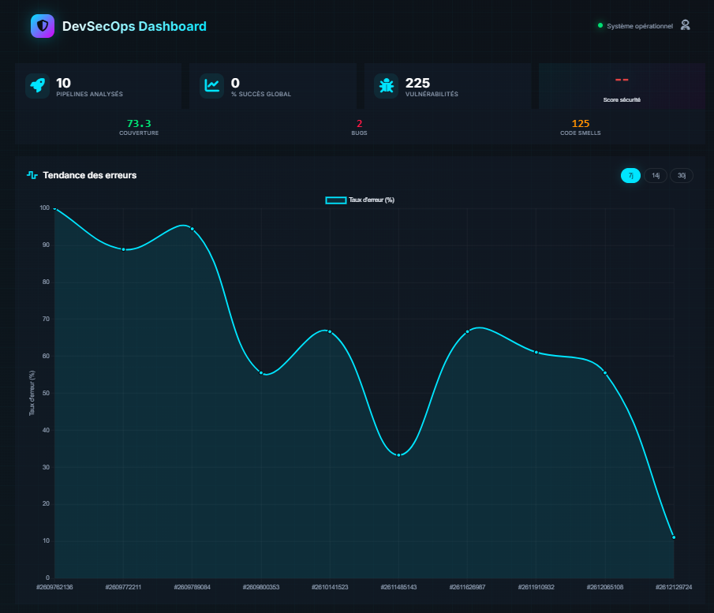
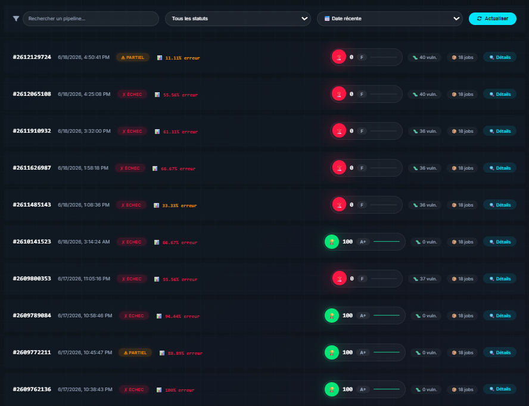
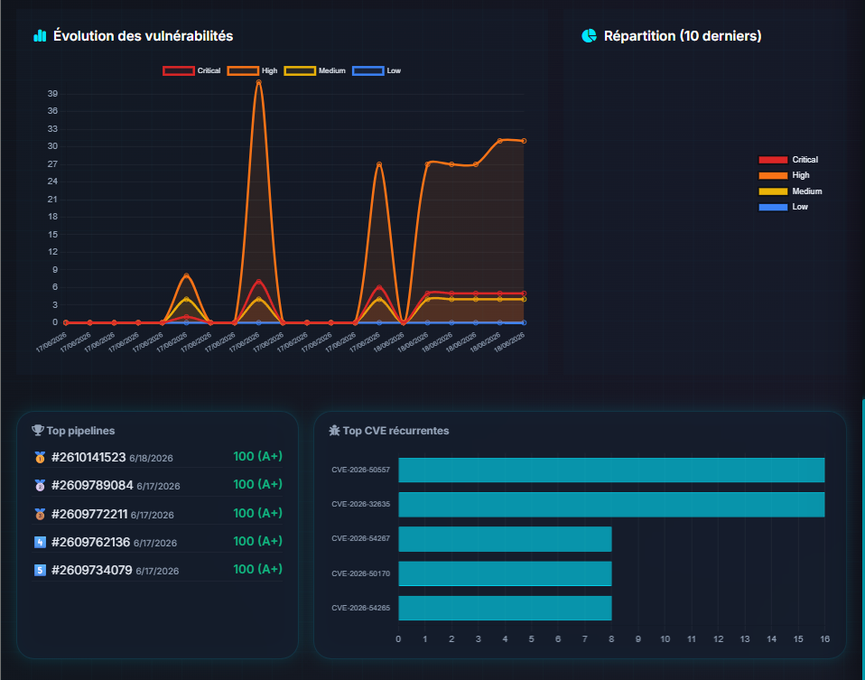
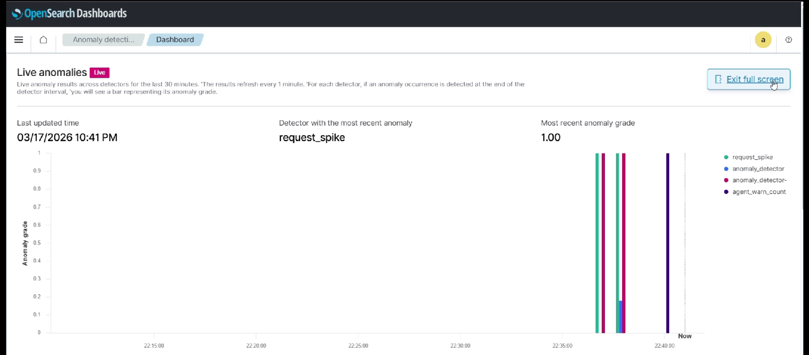
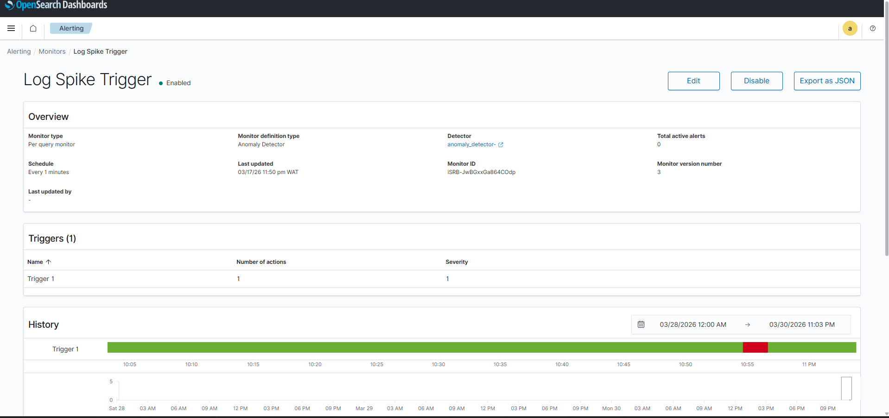
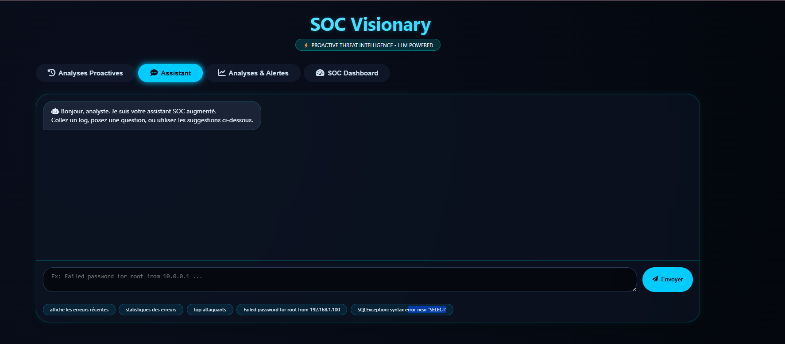
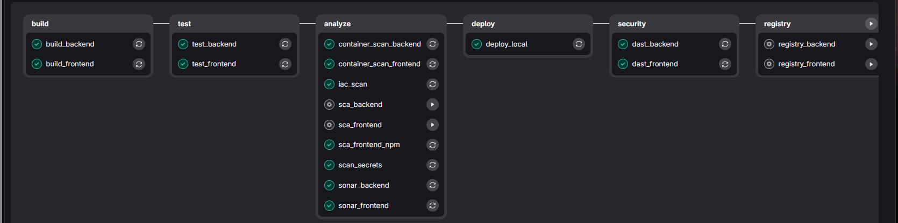

<div align="center">


# 🛡️ Plateforme DevSecOps Intelligente

### Détection d'anomalies applicatives et automatisation des alertes par l'Intelligence Artificielle

> **Projet de Fin d'Études (PFE) — 2025/2026**  
> Plateforme DevSecOps intégrant la sécurité dans le cycle CI/CD, la supervision applicative, la détection d'anomalies et un assistant SOC intelligent basé sur l'IA.

</div>

---

## 📌 Table des Matières

- [Vue d'ensemble](#-vue-densemble)
- [Problématique](#-problématique)
- [Solution Proposée](#-solution-proposée)
- [Architecture Technique](#️-architecture-technique)
- [Pipeline DevSecOps](#-pipeline-devsecops)
- [Sécurité du Pipeline](#-sécurité-du-pipeline)
- [Observabilité et Détection d'Anomalies](#-observabilité-et-détection-danomalies)
- [Assistant SOC Intelligent](#-assistant-soc-intelligent)
- [Intelligence Artificielle & RAG](#-intelligence-artificielle--rag)
- [Automatisation des Alertes](#-automatisation-des-alertes)
- [Stack Technologique](#-stack-technologique)
- [Fonctionnalités Clés](#-fonctionnalités-clés)
- [Structure du Projet](#-structure-du-projet)
- [Installation & Lancement](#-installation--lancement)
- [Utilisation](#-utilisation)
- [Démo](#-démo)
- [Captures d'écran](#-captures-décran)
- [Résultats](#-résultats)
- [Tests](#-tests)
- [Perspectives](#-perspectives)
- [Contribution](#-contribution)
- [Licence](#-licence)
- [Auteur](#-auteur)

---

## 🎯 Vue d'ensemble

**DevSecOps Intelligent Platform** est une solution complète développée dans le cadre d'un **Projet de Fin d'Études** avec pour objectif de mettre en place une chaîne **DevSecOps intelligente**, permettant d'intégrer automatiquement la sécurité dans le cycle de développement tout en assurant la supervision des applications et la détection d'anomalies.

La solution combine :

- 🔄 **CI/CD** pour automatiser le cycle de livraison
- 🔐 **DevSecOps** pour intégrer plusieurs contrôles de sécurité
- 📊 **Observabilité** pour surveiller les applications et les infrastructures
- 🚨 **Détection d'anomalies** basée sur l'analyse des logs
- 🤖 **Intelligence Artificielle** pour assister l'analyse des incidents
- 🧠 **RAG** pour exploiter des connaissances de cybersécurité
- ⚡ **Automatisation des alertes** et du traitement des incidents

---

## ❓ Problématique

Les applications modernes génèrent un volume important de données, de logs et d'événements de sécurité.

Une surveillance manuelle de ces événements peut rendre difficile :

- l'identification rapide des comportements anormaux ;
- la corrélation de plusieurs événements ;
- l'analyse des incidents ;
- la priorisation des alertes ;
- la réaction rapide face aux menaces.

L'objectif est donc de proposer une plateforme capable de **sécuriser le cycle de développement**, **surveiller les applications** et **assister les analystes SOC dans l'analyse des événements**.

---

## 💡 Solution Proposée

La plateforme repose sur plusieurs composants complémentaires :

```text
                    ┌──────────────────────────┐
                    │      Développeur         │
                    └────────────┬─────────────┘
                                 │
                                 ▼
                    ┌──────────────────────────┐
                    │       GitLab CI/CD       │
                    └────────────┬─────────────┘
                                 │
             ┌───────────────────┼───────────────────┐
             ▼                   ▼                   ▼
        ┌─────────┐        ┌────────────┐      ┌─────────┐
        │  SAST   │        │    SCA     │      │ Secrets │
        │SonarQube│        │ OWASP /    │      │Gitleaks │
        │         │        │ npm audit  │      │         │
        └─────────┘        └────────────┘      └─────────┘
             │                   │                   │
             └───────────────────┼───────────────────┘
                                 ▼
                    ┌──────────────────────────┐
                    │   Build & Docker Image   │
                    └────────────┬─────────────┘
                                 │
                                 ▼
                    ┌──────────────────────────┐
                    │   Security Containers    │
                    │         Trivy            │
                    └────────────┬─────────────┘
                                 │
                                 ▼
                    ┌──────────────────────────┐
                    │       Staging            │
                    └────────────┬─────────────┘
                                 │
                                 ▼
                    ┌──────────────────────────┐
                    │        OWASP ZAP         │
                    │          DAST             │
                    └────────────┬─────────────┘
                                 │
                                 ▼
                    ┌──────────────────────────┐
                    │     Application          │
                    └────────────┬─────────────┘
                                 │
                    ┌────────────┴─────────────┐
                    ▼                          ▼
             ┌─────────────┐            ┌─────────────┐
             │ Prometheus  │            │   Filebeat  │
             │ / Grafana   │            │             │
             └─────────────┘            └──────┬──────┘
                                               │
                                               ▼
                                      ┌─────────────────┐
                                      │   OpenSearch    │
                                      │ Logs + Anomaly  │
                                      │    Detection    │
                                      └────────┬────────┘
                                               │
                                               ▼
                                      ┌─────────────────┐
                                      │   SOC Assistant │
                                      │ FastAPI + RAG   │
                                      │ Mistral / Ollama│
                                      └────────┬────────┘
                                               │
                              ┌────────────────┼────────────────┐
                              ▼                ▼                ▼
                         Risk Score        n8n        Slack Alerts
```

---

## 🏗️ Architecture Technique

```text
┌─────────────────────────────────────────────────────────────────┐
│                        FRONTEND (Angular)                        │
│           Dashboard SOC │ Vue des Alertes │ Analyse IA          │
│                    Visualisations : Grafana / Charts             │
└─────────────────────┬───────────────────────────────────────────┘
                      │  REST API
┌─────────────────────▼───────────────────────────────────────────┐
│                    BACKEND (Spring Boot / FastAPI)               │
│    Ingestion de Données │ API de Détection │ Moteur d'Alerte   │
│            Cache : Redis │ Base de données : PostgreSQL          │
└──────────┬──────────────────────┬───────────────────────────────┘
           │                      │
┌──────────▼──────────┐  ┌────────▼────────────────────────────┐
│   PIPELINE IA/ML    │  │         SOURCES DE DONNÉES           │
│ Scikit-learn │ RAG  │  │  Logs (OpenSearch) │ GitLab API      │
│ Mistral/Ollama│ NLP │  │  Prometheus │ Filebeat │ Trivy       │
└─────────────────────┘  └─────────────────────────────────────┘
```

---

## 🔄 Pipeline DevSecOps

Le pipeline CI/CD automatise les différentes étapes nécessaires à la construction, au test et à la sécurisation de l'application.

### Étapes principales

```text
Code
 │
 ▼
Build
 │
 ▼
Tests
 │
 ▼
SAST
 │
 ▼
SCA
 │
 ▼
Secret Detection
 │
 ▼
Container Security
 │
 ▼
Infrastructure Security
 │
 ▼
Staging
 │
 ▼
DAST
 │
 ▼
Registry
```

---

## 🔐 Sécurité du Pipeline

Plusieurs contrôles de sécurité sont intégrés directement dans le pipeline CI/CD.

| Contrôle | Outil | Objectif |
|---|---|---|
| **SAST** | SonarQube | Analyse statique du code |
| **SCA** | OWASP Dependency-Check | Détection des dépendances vulnérables |
| **SCA** | npm audit | Analyse des dépendances frontend |
| **Container Security** | Trivy | Analyse des images Docker |
| **Secrets** | Gitleaks | Détection des secrets exposés |
| **IaC Security** | Checkov | Analyse de la configuration IaC |
| **DAST** | OWASP ZAP | Tests dynamiques de sécurité |

### 🔎 Quality Gates

Les principaux objectifs du pipeline sont notamment :

- **Security Rating** : A
- Aucun problème Blocker / High critique accepté
- Vérification des Security Hotspots
- Couverture de tests ≥ 50 %
- Duplication du code < 15 %

---

## 📊 Observabilité et Détection d'Anomalies

La plateforme utilise une architecture d'observabilité permettant de centraliser les métriques et les logs.

### Monitoring

Prometheus collecte les métriques tandis que Grafana permet leur visualisation.

### Centralisation des logs

Les logs applicatifs sont collectés avec Filebeat puis centralisés dans OpenSearch.

```text
Application
     │
     ▼
   Logs
     │
     ▼
  Filebeat
     │
     ▼
 OpenSearch
     │
     ├──────────────► Recherche & Analyse
     │
     └──────────────► Anomaly Detection
```

La plateforme a permis de centraliser plusieurs millions d'événements pour l'analyse et la détection des comportements anormaux.

---

## 🚨 Détection d'Anomalies

Le moteur **OpenSearch Anomaly Detection** utilise l'algorithme **Random Cut Forest (RCF)** .

Configuration utilisée dans le projet :

| Paramètre | Valeur |
|---|---|
| Window size | 128 |
| Shingle size | 8 |
| Anomaly grade threshold | 0.7 |

Le système analyse l'évolution des événements afin d'identifier des comportements qui s'écartent du comportement habituel.

---

## 🤖 Assistant SOC Intelligent

La plateforme intègre un assistant SOC développé avec **FastAPI**.

Son rôle est d'assister l'analyste dans :

- l'analyse des logs ;
- l'identification des types d'événements ;
- l'évaluation du niveau de risque ;
- la recherche d'informations de cybersécurité ;
- la corrélation d'événements ;
- la génération d'une réponse contextualisée.

### Architecture

```text
                  SOC Web Interface
                         │
                         ▼
                    FastAPI
                         │
          ┌──────────────┼──────────────┐
          ▼              ▼              ▼
     Intent/NLU      Log Analyzer    Risk Scorer
          │              │              │
          └──────────────┼──────────────┘
                         ▼
                  Rules Engine
                         │
             ┌───────────┴───────────┐
             ▼                       ▼
        OpenSearch                  RAG
        Logs / Data            MITRE ATT&CK
             │                       │
             └───────────┬───────────┘
                         ▼
                    Mistral LLM
                      Ollama
                         │
                         ▼
                  Analyse / Réponse
                         │
                         ▼
                    Risk Score
                         │
                         ▼
                  n8n / Slack
```

---

## 🧠 Intelligence Artificielle & RAG

L'assistant utilise un modèle **Mistral** exécuté localement avec **Ollama**.

La solution utilise également une approche **Retrieval-Augmented Generation (RAG)** permettant d'enrichir les réponses du modèle avec une base de connaissances de cybersécurité.

### Base de connaissances

La base `soc_knowledge` contient notamment :

- connaissances MITRE ATT&CK ;
- procédures d'analyse ;
- playbooks SOC ;
- informations utiles à l'investigation.

Les documents sont transformés en embeddings puis stockés dans **OpenSearch**.

---

## 🧩 Analyse des Intentions

Le chatbot dispose d'un module de classification des intentions permettant d'identifier le type de demande de l'analyste.

Exemples :

```text
Question analyste
       │
       ▼
 Intent Classifier
       │
       ├── Analyse de log
       ├── Threat Intelligence
       ├── Incident
       ├── Recherche
       └── Autre
```

L'analyse combine notamment :

- règles ;
- expressions régulières ;
- NLU ;
- classification ;
- recherche RAG ;
- LLM.

---

## ⚠️ Risk Scoring

Chaque événement analysé peut recevoir un score de risque.

```text
Logs
 │
 ▼
Analyse
 │
 ▼
Corrélation
 │
 ▼
Risk Scoring
 │
 ├── Faible
 ├── Moyen
 └── Élevé
       │
       ▼
   Automatisation
```

Lorsque le niveau de risque dépasse le seuil défini, une automatisation peut être déclenchée via **n8n**.

---

## ⚡ Automatisation des Alertes

La plateforme permet de connecter l'analyse SOC à un workflow d'automatisation.

```text
Détection
    │
    ▼
Risk Score
    │
    │ Score > seuil
    ▼
   n8n
    │
    ▼
Notification
    │
    ▼
  Slack
```

Cette approche permet de réduire les actions manuelles nécessaires pour le traitement initial des événements.

---

## 💻 Stack Technologique

### Backend


### Frontend


### DevSecOps


### Monitoring & Observabilité


### Intelligence Artificielle


| Domaine | Outil/Lib |
|---|---|
| **CI/CD** | GitLab CI/CD |
| **SAST** | SonarQube |
| **SCA** | OWASP Dependency-Check, npm audit |
| **Container Security** | Trivy |
| **Secrets Detection** | Gitleaks |
| **IaC Security** | Checkov |
| **DAST** | OWASP ZAP |
| **Monitoring** | Prometheus, Grafana |
| **Log Management** | Filebeat, OpenSearch |
| **Anomaly Detection** | Random Cut Forest (RCF) |
| **LLM** | Mistral (via Ollama) |
| **RAG** | OpenSearch Vector Search |
| **Automatisation** | n8n |
| **Notifications** | Slack |

---

## ✨ Fonctionnalités Clés

- 🔄 **Pipeline CI/CD automatisé** — Intégration continue et déploiement continu
- 🔐 **Intégration de contrôles de sécurité** — SAST, SCA, DAST, Container Security
- 🧪 **Tests automatisés** — Exécution automatique des tests à chaque commit
- 🔎 **Analyse SAST et SCA** — Détection des vulnérabilités dans le code et les dépendances
- 🐳 **Sécurisation des images Docker** — Scan des images avec Trivy
- 🔑 **Détection des secrets** — Identification des secrets exposés avec Gitleaks
- 🏗️ **Analyse de l'Infrastructure as Code** — Vérification avec Checkov
- 🌐 **Tests DAST** — Tests dynamiques avec OWASP ZAP
- 📊 **Monitoring avec Prometheus et Grafana** — Visualisation des métriques
- 📝 **Centralisation des logs avec OpenSearch** — Agrégation de millions d'événements
- 🚨 **Détection d'anomalies** — Algorithme Random Cut Forest
- 🤖 **Assistant SOC basé sur l'IA** — FastAPI + Mistral
- 🧠 **RAG basé sur des connaissances de cybersécurité** — MITRE ATT&CK, playbooks
- ⚠️ **Risk scoring** — Évaluation du niveau de risque des événements
- 🔗 **Corrélation d'événements** — Analyse multi-événements
- ⚡ **Automatisation des alertes avec n8n** — Workflows automatisés
- 💬 **Notifications Slack** — Alertes en temps réel

---

## 📁 Structure du Projet

```text
devsecops-pfe/
│
├── backend/                         # Backend Spring Boot
│   ├── src/
│   │   ├── main/
│   │   │   ├── java/
│   │   │   └── resources/
│   │   └── test/
│   ├── pom.xml
│   └── Dockerfile
│
├── frontend/                        # Application Angular
│   ├── src/
│   │   ├── app/
│   │   │   ├── components/
│   │   │   ├── services/
│   │   │   └── models/
│   │   ├── assets/
│   │   └── environments/
│   ├── package.json
│   └── Dockerfile
│
├── soc-chatbot/                     # Assistant SOC (FastAPI)
│   ├── app/
│   │   ├── main.py                  # Point d'entrée FastAPI
│   │   ├── intent_classifier.py     # Classification des intentions
│   │   ├── nlu.py                   # Traitement du langage naturel
│   │   ├── risk_scorer.py           # Scoring de risque
│   │   ├── rules_engine.py          # Moteur de règles
│   │   ├── log_analyzer.py          # Analyse des logs
│   │   ├── temporal_analyzer.py     # Analyse temporelle
│   │   ├── attack_correlator.py     # Corrélation d'attaques
│   │   ├── rag_engine.py            # Moteur RAG
│   │   └── ...
│   ├── requirements.txt
│   └── Dockerfile
│
├── .gitlab-ci.yml                   # Configuration GitLab CI/CD
├── docker-compose.yml               # Orchestration des services
├── Dockerfile                       # Dockerfile principal
└── README.md
```

---

## 🚀 Installation & Lancement

### Prérequis

- Java 17
- Maven / Maven Wrapper
- Node.js 18+
- Docker
- Docker Compose
- Python 3.10+
- Git

### Cloner le projet

```bash
git clone <URL_DU_REPOSITORY>
cd devsecops-pfe
```

### Lancer les services

```bash
docker compose up -d
```

### Vérifier les conteneurs

```bash
docker ps
```

### Lancer le backend

```bash
./mvnw spring-boot:run
```

### Lancer le frontend

```bash
cd frontend
npm install
npm start
```

### Lancer l'assistant SOC

```bash
cd soc-chatbot
python -m venv venv
source venv/bin/activate  # Windows : venv\Scripts\activate
pip install -r requirements.txt
uvicorn app.main:app --reload
```

---

## 🎮 Utilisation

### Accéder à l'application

- **Frontend** : `http://localhost:4200`
- **Backend API** : `http://localhost:8080`
- **Assistant SOC** : `http://localhost:8000`
- **Grafana** : `http://localhost:3000`
- **OpenSearch Dashboards** : `http://localhost:5601`

### Scénario typique

1. Un développeur pousse son code sur GitLab.
2. Le pipeline CI/CD se déclenche automatiquement.
3. Les contrôles de sécurité (SAST, SCA, etc.) sont exécutés.
4. En cas de succès, l'application est déployée en staging.
5. Les logs sont collectés par Filebeat et envoyés à OpenSearch.
6. Le moteur d'anomalies détecte un comportement suspect.
7. L'assistant SOC analyse l'événement et génère un score de risque.
8. Si le score dépasse le seuil, une alerte Slack est envoyée via n8n.

---

## 📸 Captures d'écran

### Dashboard SOC




*Vue principale du tableau de bord DevSecOps avec les alertes en temps réel.*

### Analyse des logs




*Interface d'analyse des logs avec détection d'anomalies.*

### Assistant SOC



*Chatbot d'assistance SOC avec réponses contextuelles basées sur le RAG.*

### Pipeline CI/CD



*Visualisation du pipeline GitLab CI/CD avec les différents stages de sécurité.*

> **💡 Comment ajouter vos propres captures d'écran ?**
> 
> 1. Créez un dossier `docs/screenshots/` à la racine de votre projet.
> 2. Placez-y vos images (PNG, JPG, GIF).
> 3. Utilisez la syntaxe Markdown suivante :
>    ```markdown
>    
>    ```
> 4. Pour un GIF animé :
>    ```markdown
>    
>    ```

---

## 📈 Résultats

Quelques résultats obtenus durant le projet :

### 🐳 Optimisation des images Docker

| Service | Avant | Après | Réduction |
|---|---|---|---|
| Backend | 648 MB | 187 MB | ~71 % |
| Frontend | 432 MB | 52 MB | ~88 % |

### 🔐 Sécurité

- **Checkov** : 91 % de conformité sur les contrôles évalués
- **Backend Trivy** : 0 Critical, 1 High
- **Frontend Trivy** : 0 Critical / High
- **SonarQube** : Objectif Security Rating A atteint

### 📊 Logs

- Centralisation de **plusieurs millions d'événements** dans OpenSearch
- Détection d'anomalies basée sur **Random Cut Forest**

---

## 🧪 Tests

### Backend

```bash
./mvnw test
```

### Frontend

```bash
cd frontend
npm test
```

### Assistant SOC

```bash
cd soc-chatbot
pytest
```

---

## 🔮 Perspectives

Plusieurs améliorations peuvent être envisagées :

- Intégration de davantage de sources **Threat Intelligence**
- Amélioration de la **corrélation multi-événements**
- Enrichissement automatique des **incidents**
- Ajout de nouveaux **playbooks SOC**
- Amélioration du modèle de **classification des intentions**
- Intégration avec d'autres outils **SIEM/SOAR**
- Amélioration de l'**automatisation de la réponse aux incidents**

---

## 👩‍💻 Auteur

**Rania Jarray**

Ingénieure Cybersécurité & DevSecOps

🎓 Projet de Fin d'Études — **TEK-UP**

📌 **Thème :**  
Plateforme DevSecOps intelligente avec détection d'anomalies applicatives et automatisation des alertes par l'intelligence artificielle

[](https://linkedin.com/in/jarray-rania-652195203/)

---

<div align="center">

**⭐ N'hésitez pas à star ce projet s'il vous a été utile !**

*Projet réalisé dans le cadre du PFE — TEK-UP × 2025/2026*

</div>
---
